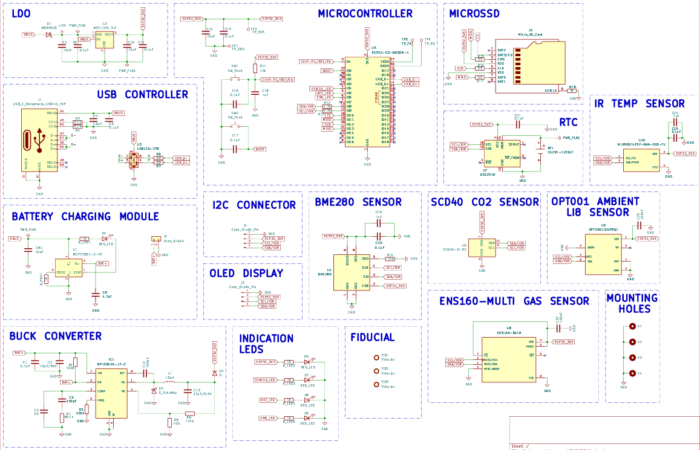
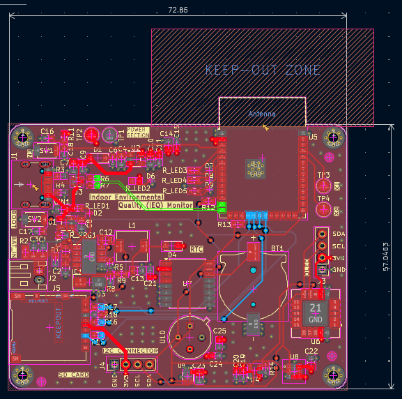
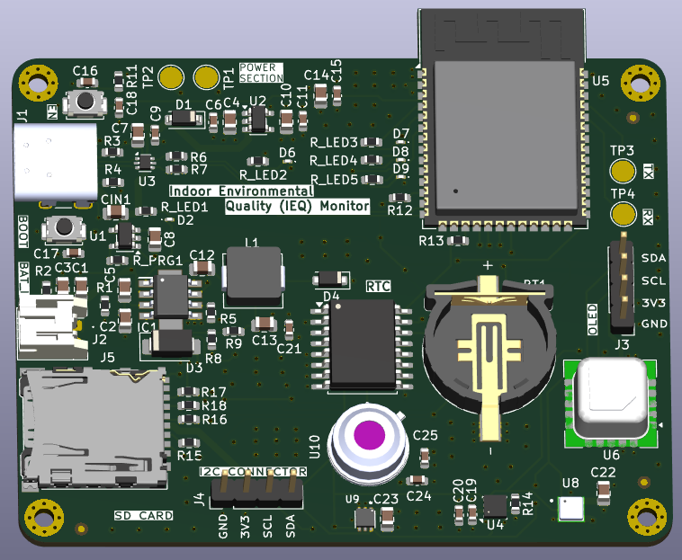

# 🌿 ESP32 Indoor Environmental Quality (IEQ) Monitor — Hardware Design  

  A compact multi-sensor environmental monitoring system built using ESP32

---

This project showcases the schematic and PCB design of a **multi-sensor Indoor Environmental Quality (IEQ) monitoring system**, capable of measuring air quality, CO₂ levels, temperature, humidity, and ambient light.

It focuses on **real-world embedded hardware design**, emphasizing **power integrity, sensor interfacing, and clean PCB layout practices**.

---

## ⚙️ Working Principle

- ESP32 acts as the main controller (Wi-Fi + BLE)
- Sensors connected via I2C:
  - BME280 → Temperature, Humidity, Pressure  
  - SCD40 → CO₂ concentration  
  - ENS160 → Air quality (VOC, AQI)  
  - OPT3001 → Ambient light  
- Data is:
  - Displayed on OLED
  - Logged to microSD card
- RTC provides timestamps
- Buttons + LEDs + buzzer for interaction

---

## 🎯 Objective

To design a robust hardware platform demonstrating:

- Multi-sensor integration  
- Clean power architecture  
- I2C-based expansion  
- Practical PCB layout techniques  
- Embedded system design  

---

## 🧩 Hardware Overview

| No. | Component | Role |
|------|------------|--------|
| 1 | ESP32 | Main MCU |
| 2 | BME280 | Temp, Humidity, Pressure |
| 3 | SCD40 | CO₂ sensor |
| 4 | ENS160 | Air quality |
| 5 | OPT3001 | Light sensor |
| 6 | RTC | Timekeeping |
| 7 | OLED | Display |
| 8 | microSD | Data logging |
| 9 | MP1584 | Buck converter |
| 10 | AP2112K | LDO regulator |
| 11 | Buttons/LEDs | User interface |

---

## 🔋 Power Architecture

### USB Power Path

- Reverse protection  
- Clean regulated output  

---

### Battery Power Path

- High efficiency  
- Standalone operation  

---

### Design Considerations

- No reverse current into LDO  
- Unified 3V3 rail  
- Proper decoupling (10µF + 0.1µF)  
- Stable supply for ESP32  

---

## 🧠 PCB Design Details

### Stackup (4 Layers)

| Layer | Function |
|------|--------|
| L1 | Components + signals |
| L2 | GND plane |
| L3 | 3V3 plane |
| L4 | Routing |

---

### Grounding

- Solid ground plane  
- Via stitching  
- Low impedance return paths  

---

### Routing Strategy

- Power routed first  
- Signals routed next  
- Ground poured last  

---

## 📷 Preview

### Schematic  

### PCB  

### 3D View  

---

## ✨ Key Features

- Multi-sensor monitoring  
- Dual power input  
- 4-layer PCB  
- Clean grounding  
- Expandable I2C  
- Data logging  
- OLED interface  

---

## 🧪 Design Challenges

- Power backflow handling  
- Net naming (3V3 vs ESP32_3V3)  
- Clearance & DRC issues  
- Ground plane interference  

---

## 🚀 Future Improvements

- Voice assistant integration  
- Mobile app  
- OTA updates  
- Battery management  
- Enclosure design  

---

## 📚 Learning Outcomes

- Power design
- Multilayer PCB Designing
- Types of Vias
- Via Stitching
- PCB routing techniques
- Grounding strategies  
- Sensor interfacing  
- Debugging hardware  

---

## 🤝 Contributions

Open for improvements and suggestions.
