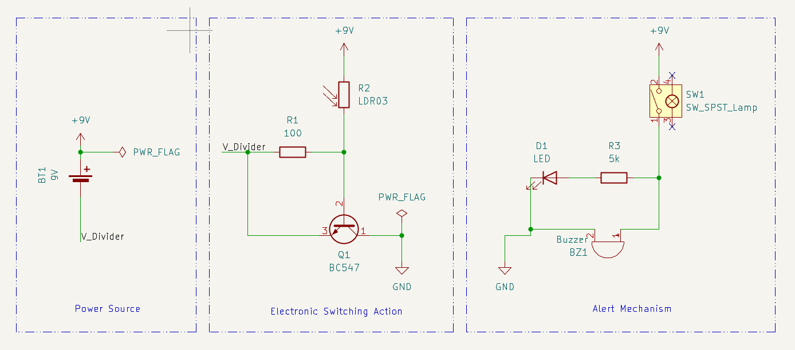
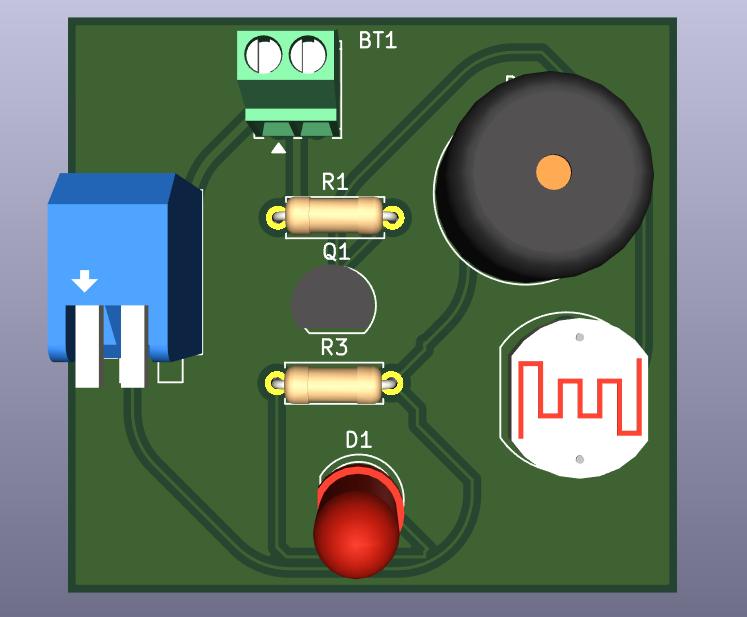

# 🔥 Fire Alarm System — PCB Project (As part of my Semester-II curriculum)
   A simple and low-cost fire alarm system based on LDR (Light Dependent Resistor) and BJT. This project includes the schematic and PCB layout designed in KiCad.

---

## ⚙ Working Principle
  * The system uses an LDR (Light Dependent Resistor) to detect changes in light intensity.
  * In the event of a fire, the light from flames increases the light falling on the LDR, reducing its resistance.
  * This change triggers a BJT (Bipolar Junction Transistor) to conduct, activating the buzzer and LED to alert nearby individuals.

---

## 📌 Objective
   To design, simulate, and layout a compact fire detection circuit that responds to light intensity variations, suitable for fire-prone zones or domestic safety applications.

---

## ⚙ Components Used
| No. | Components           | Specifications          |
| :---: | :--------------------: | :-----------------------: |
| 1.  | Battery              | 9V                      |
| 2.  | Transistor (NPN BJT) | BC547                   |
| 3.  | LDR                  | Standard                |
| 4.  | Resistors            |                         |
| 5.  | LED                  | Red (2V forward drop)   |
| 6.  | Buzzer               | 5V-9V piezo or magnetic |

---

## 📷 Preview

### 🖼 Schematic Circuit Diagram  

### 📐 PCB Layout  

### 🧊 3-D Front View  

---

## 🔄 Future Improvements
- Add temperature, smoke and IR sensors 
- Microcontroller integration (e.g. ATmega328 or ESP32)
- IoT capability for remote alerts (e.g., SMS / Blynk app)
- Adjustable Sensitivity

